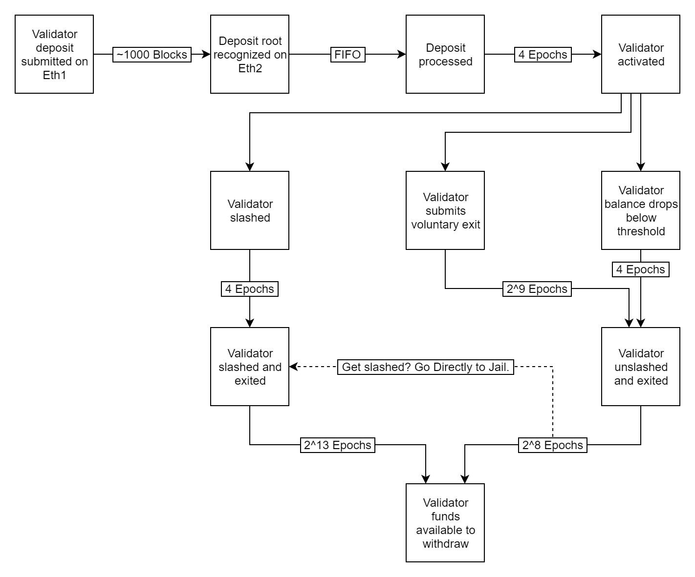

# {{ $frontmatter.title }}

::: tip NOTE
Section needs some a stronger vision.
:::

::: tip TODO
Need some sort of intro here, but it largely depends on how we start this chapter.
:::

::: tip TODO
Temporary diagram, needs to be rebuilt before publication.
:::

::: tip TODO
Some sort of fluff about this diagram, just skipping into content for now.
:::

## Joining the System

The process of becoming an Eth2 validator begins by submitting a deposit of 32 ETH as collateral in case the validator violates any of our slashing rules. Since ETH currently only lives inside Eth1, these deposits are handled by a special "deposit contract" on the Eth1 chain.

::: tip NOTE
I don't think this is the right place to talk about the deposit contract in detail, but not sure.
:::

Potential validators send a transaction to the deposit contract that contains 32 ETH and certain authentication credentials. Once their deposits have been submitted, users must wait for their deposits to be recognized and processed on Eth2. The Beacon Chain will only process a limited number of deposits within each block, so users may face in implicit waiting period in the event that many others have submitted deposits.

After their deposits are processed on the Beacon Chain, users are required to wait for an additional period of four epochs before becoming active validators.

## Leaving the System

The process of leaving the Beacon Chain is split into two stages, the "exit" stage followed by the "withdrawal" stage. Any validators in the process of leaving the system is first placed into the "exit" stage, during which these validators no longer participate in consensus but cannot yet withdraw any funds. After an additional waiting period, validators in the "exit" stage enter the "withdrawal" stage and may withdraw their deposits.

### Slashed Exits

Validators caught violating slashing conditions are removed from the validator pool after a period of four epochs. As an additional penalty for their actions, these validators are required to wait for `2^13 epochs`, approximately 36 days, before they are able to withdraw their funds.

### Insufficient Balance Exits

In accordance with our stake leaking mechanism, validators will lose some portion of their deposit (without violating slashing conditions) whenever they fail to produce blocks during their assigned slots. Once a validator's balance drops below a certain threshold, currently defined as 16 ETH, they are automatically exited after a period of four epochs.

Validators who are exited in this manner are required to wait an additional `2^8 epochs` before they are able to withdraw their funds. This represents the withdrawal delay that gives the network enough time to discover and publish evidence of misbehavior on the part of the validator. During this period, validators can still receive any unpaid rewards or be slashed. If a validator is slashed, they must wait the additional `2^13 epochs` of standard slashed exits.

### Voluntary Exits

Validators who no longer wish to participate in the protocol can choose to submit a voluntary exit. A validator exiting this way must wait for a period of `2^9 epochs` and be processed through the FIFO queue of exits. Just as with insufficient balance exits, validators exiting voluntarily must then wait an additional `2^8 epochs` before withdrawal, during which the validator can receive rewards or be slashed.
