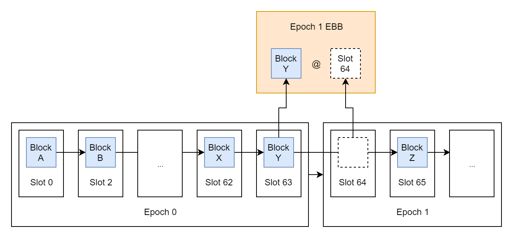

Blocks and slots and epochs, oh my! The Beacon Chain introduces a lot of new terminology to the world of blockchains. Although most blockchains are simply described as ordered lists of blocks, the Proof of Stake Beacon Chain relies on a few more structural concepts.

## Blocks

The Eth2 Beacon Chain is, perhaps unsurprisingly, composed of blocks. Unlike Eth1, however, Beacon Chain blocks don't contain smart contract transactions or store application-level data. Beacon Chain blocks only contain "system-level" transactions, such as punishments for validators who have misbehaved. Applications instead reside on Shard Chains, as introduced in Phase 1 and Phase 2.

## Slots

Eth2 introduces the new concept of slots, periods of time in which a validator has the right to produce a block. The Beacon Chain assigns validators to different slots before these slots actually happen. If a validator fails to produce a block during their assigned slot, then the validator assigned to the next slot will produce a block instead.

Eth2 defines each slot to be six seconds long. The first block in the Beacon Chain, the genesis block, includes a "start time." We can always compute the current slot by looking at how much time has passed since that initial "start time." For example, if each slot is six seconds long and the genesis block was created 6000 seconds ago, then the current slot is `6000 seconds / 6 seconds = slot 1000`.

It's worth noting that although slots are a new concept in the Beacon Chain, we still maintain the traditional idea of block height. In the above diagram, the third block (`block 2`) has a height of two (assuming that the genesis block has a height of zero), even though it was produced in `slot 4`.

## Epochs

Epochs are defined as a specified number of slots and have the purpose of forming larger chunks of time. Eth2 epochs are defined as 64 slots, so the amount of time elapsed within each epoch is `6 seconds per slot * 64 slots per epoch = 6.4 minutes per epoch`. As with slots, we can determine the current epoch by looking at the amount of time elapsed since the production of the genesis block.

Epochs are markers for several important events in the life-cycle of the beacon chain. For instance, certain accounting tasks are only executed at the start of a new epoch.

### Epoch Boundary Blocks
The Beacon Chain defines unique "epoch boundary blocks," or EBBs, in order to easily reference a given epoch.

If a block was created in the first slot of an epoch, then that block is the EBB for that epoch:

If no block was created in the first slot of an epoch, then we "pull" the last block created before that slot into the current slot as the EBB:

