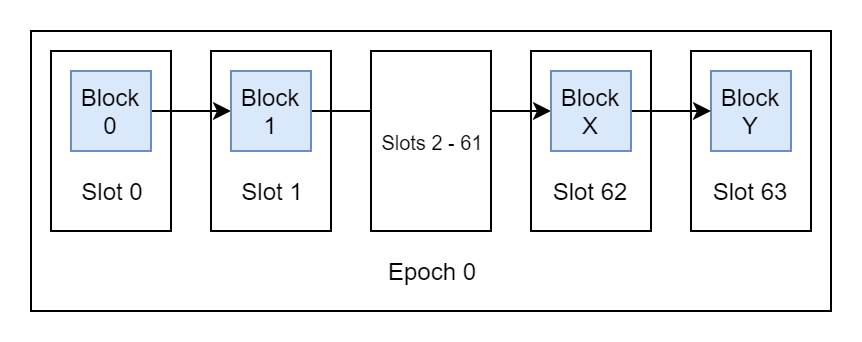

Blocks and slots and epochs, oh my!

Although most blockchains can be simply described as ordered lists of blocks, the Eth2 Beacon Chain introduces new and important structural concepts.

## Blocks

The Beacon Chain is, perhaps unsurprisingly, still composed of **blocks**. Unlike Eth1, however, Beacon Chain blocks don't contain smart contract transactions or store application-level data. Instead, Beacon Chain blocks only contain "system-level" transactions, such as punishments for validators who have misbehaved. Applications reside on Shard Chains, a topic explored further in [Phase 1](/chapters/phase-1) and [Phase 2](/chapters/phase-2).

## Slots

The Beacon Chain also consists of **slots**, periods of time in which a validator has the right to produce a block. The Beacon Chain assigns a validator to slots in advance of the actual slot time. If a validator fails to produce a block during their assigned slot, then the validator assigned to the next slot will produce a block instead.

Slots are currently defined to be 12 seconds long. The first block in the Beacon Chain, the genesis block, includes a "start time." We can compute the current slot by looking at how much time has passed since that initial starting time. For example, if each slot is 12 seconds long and the genesis block was created 1200 seconds ago, then the current slot is `1200 seconds / 12 seconds = slot 100`.

It's worth noting that, although we often use slots to reference to specific Beacon Chain blocks, we still maintain the traditional idea of block height. In the above diagram, the third block (`block 2`) has a height of two (assuming that the genesis block has a height of zero), even though it was produced in `slot 4`.

## Epochs

Epochs are defined as a specified number of slots and represent larger chunks of time. Beacon Chain epochs are currently defined to be 32 slots, so the amount of time elapsed within each epoch is `12 seconds per slot * 32 slots per epoch = 6.4 minutes per epoch`. As with slots, we can determine the current epoch by looking at the amount of time elapsed since the production of the genesis block.

Epochs are markers for several important events in the life-cycle of the Beacon Chain. For instance, certain accounting tasks are only executed at the start of a new epoch.

### Epoch Boundary Blocks
Every epoch has a unique corresponding "epoch boundary block," or EBB, used as an easy reference to the epoch. Which block serves as an EBB for an epoch depends on whether or not a block was created in the first slot of that epoch.

For example, if a block was created in the first slot of an epoch, then that block is the EBB for the epoch:

Here, the EBB for `Epoch 1` is `(Block Z, Slot 64)`, sometimes stylized as `Block Z @ Slot 64`.

If no block was created in the first slot of an epoch, then we "pull" the last block created before that slot into the current slot as the EBB:

In this case, the EBB for `Epoch 1` is `(Block Y, Slot 64)`. Note that we aren't actually "moving" `Block Y` into `Slot 64`, but simply stating the slot in which the block is being used as an EBB. 