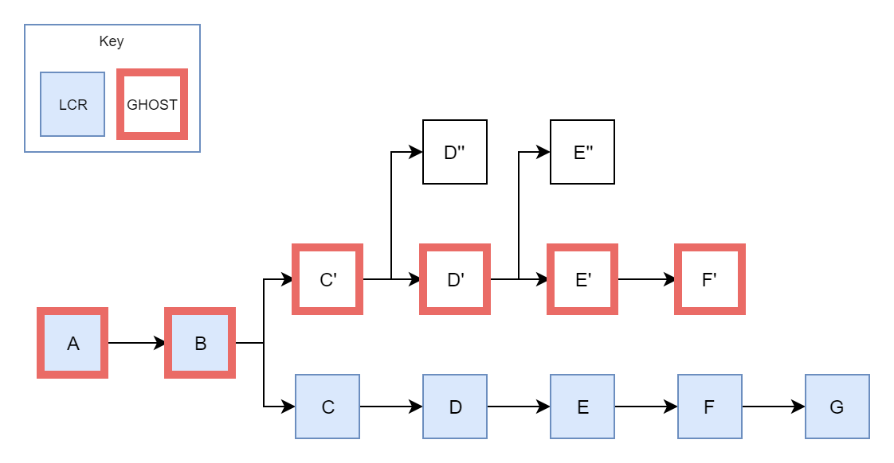

## On Fork-Choice Rules
Blockchains can fork for any number of reasons. Although we might think about forks as those big, contentious events that create money out of thin air, most forks are relatively short-lived and occur naturally as a result of menial things like network latency. For example, a Proof of Work blockchain might temporarily fork if two users happen to find blocks at the same time.

Validators need some method to determine which fork to keep following at any given time. No matter the specific process a validator uses, we call this decision a "fork-choice rule." Vitalik sums up the concept of a fork-choice rule concisely:

> A fork choice rule is a function, evaluated by the client, that takes as input the set of blocks and other messages that have been produced, and outputs to the client what the “canonical chain” is.

The "original" fork-choice rule was the "longest-chain" rule, which effectively tells clients to follow whichever fork has the most number of blocks. For example, the longest-chain rule would pick `Block F` as the current head in the following chain:

This method works well in the context of a Proof of Work blockchain because blocks take a lot of computational resources to produce. In practice, Proof of Work blockchains tweak this rule slightly so that clients follow whichever chain has the most "work" behind it, though the two metrics are often aligned.

## GHOST
GHOST (Greedy Heaviest Observed Subtree) is an alternative to the longest-chain rule. Unlike the longest-chain rule, GHOST factors in uncle blocks, blocks which are forks of a chain but don't extend the length of the chain. In the following diagram, `Block B'` is an uncle of the longest chain (headed by `Block D`) because it builds off of one of its components (`Block A`):

Uncle blocks are important because, even they don't extend the chain directly, they imply that the creator of the uncle block meant to extend that chain. If we simply ignore uncle blocks, then we're wasting the work put into these blocks by their creators. 

The GHOST fork-choice rule finds the head canonical chain by the following algorithm:

1. Start at the genesis block.
2. Find all available forks.
3. If there are no forks (no more blocks in the chain), return the current block. Otherwise, pick the fork with the most total blocks, even if it's not the longest chain.
4. Go to step (2), starting from the first block in the fork we just picked.

Again, in practice we modify this algorithm slightly to look at the amount of work behind each block instead of weighting each block equally.

### GHOST vs. LCR
GHOST and LCR often agree in their results:

Here, both LCR and GHOST pick `Block F` as the the head of the chain.

However, in some cases, GHOST and LCR will disagree: 

In this chain, GHOST diverges from LCR at `Block B`, where have two potential forks to consider, `Block C` and `Block C'`. Although the chain following `Block C` is five blocks long, there are a total of six blocks in the tree starting with `Block C'`. Therefore, GHOST will switch to `Block C'` and LCR will switch to `Block C`.

## LMD-GHOST
GHOST chooses between different forks depending on the total number of blocks in each fork. This is fine, because GHOST was originally designed to function within a Proof of Work environment where blocks are difficult to produce. However, Proof of Stake validators only need to do a minimal amount of work, in the form of a single signature, to produce new blocks. If we simply looked at the total number of blocks in a chain, then a validator could easily attack the network by creating many blocks in a row:

Here, `Validator B` has caused GHOST to pick their own chain, simply because they created a few blocks in a row. We obviously don't want a single validator to be able to attack the network this way, so we need to add a minor modification to GHOST. Instead of looking at every message in the network, we only look at the latest messages from each validator:

Since we're only considering the last message from `Validator B`, LMD-GHOST ignores the longer chain and correctly lands on the block created by `Validator D`.

### Saved-Message Attacks
Validators are only allowed to make a single vote per epoch. However, validators could still attempt to circumvent this system by withholding votes from previous epochs and releasing them all at once in a later epoch. LMD-GHOST doesn't count two votes from the same validator on the same chain, but it will allow a validator to switch between two chains. 

TODO: ADD MORE CONTENT AND EXPOSITION

We generally limit this sort of attack by requiring that clients ignore any votes older than the previous epoch. We only take into account votes made in the current or previous epoch. 

### Interactions with Casper FFG
LMD-GHOST doesn't allow validators to circumvent blocks finalized by Casper FFG. In order to accomplish this, we run LMD-GHOST according to the following process:

1. Find the last finalized block.
2. Find the highest-epoch justified block that is a descendent of the finalized block.
3. Run LMD-GHOST from the block found in step (2).
