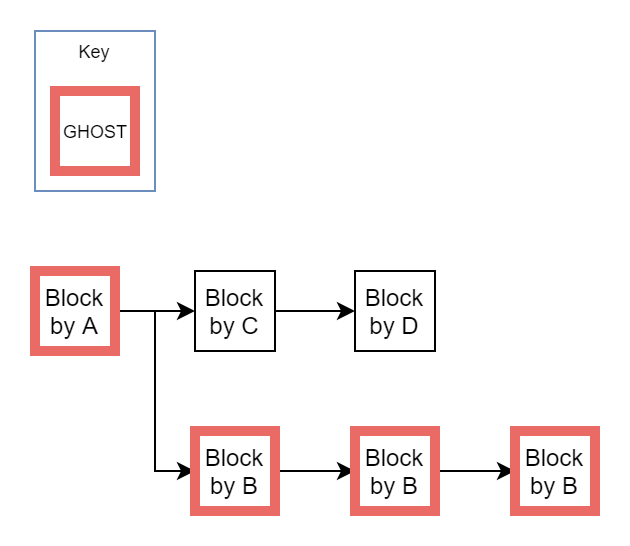

We just discussed the way in which slashing is used to discourage explicitly malicious chain forks. However, we can also get forks during normal chain operation. For instance, we might have a fork if network latency is high enough that one validator creates a block before receiving the previous validator's block.

In such a case, it's important that validators know which fork to continue building upon. Just as in our Eth1 chain, we need to define some sort of fork choice rule that directs us to the "right" chain at any given time.

## An Old Friend: The Longest-Chain Rule
The very first fork-choice rule was Bitcoin's "**longest-chain rule**," or the LCR. The LCR tells us, as we might infer from the name, to follow the longest chain:

Since we don't have the concept of "difficulty" in Proof of Stake, we need to slightly modify the LCR to decide between each potential block by the number of attestations weighted by stake.

Let's imagine we have a simple chain fork as follows:

Here, Validator B created a block on top of Block 1 during Slot 1, but perhaps Validator C didn't see that block and therefore also created another block on top of Block 1 in Slot 2. 4/5 of the members of the attestation committee voted for Block 1, but 5/5 members of the committee voted for Block 2. Using the Longest Chain Rule, we'd easily be able to select Block 2 as the "correct" chain.

Although the Longest Chain Rule is fine in many cases, there are a few instances in which the rule actually creates some undesired effects. We've discussed our honest majority assumption, which states that at least 2/3rds of validators are assumed to be honest. For the sake of simplicity, let's also assume for now that all of these validators are online.

We can demonstrate a simple attack if we have particularly high network latency over an extended period of time. We'll give our theoretical attacker 1/3rd of total stake. Our attacker is refusing to publish blocks on the main network, so the network only progresses when an honest validator is selected to create a block. Our remaining validators with 2/3rds of the stake are always producing blocks during their assigned slots, but, due to network latency, we end up with so many forks that only every other block is extending the length of the primary chain.

To abuse the Longest Chain Rule, our attacker can create a "secret" chain in which they always create blocks during their assigned slots. Since all of the validators on this secret chain are controlled by the attacker, there's no concern about latency and they'll always extend one chain during each slot.

Our attacker hasn't created blocks or voted on both networks, so we can't slash them for any of their behavior. However, if we use the longest chain rule, then both chains are equally good. Some simple network latency has allowed an attacker with only 1/3rd of the total stake to create a chain that can compete with 2/3rds of the network.

## The New Kid on the Block: LMD-GHOST
We discussed GHOST and [TODO] in the context of Eth1. As we know, GHOST chooses between different forks depending on the total number of blocks in each fork. This method works well within a Proof of Work environment where blocks are difficult to produce.

We could try to use GHOST as an alternative to the Longest Chain Rule in our chain, but we'd quickly run into problems because uncle blocks are costless. If we simply count the weight of uncle block by counting attestations on those blocks, then our attacker could once again attack the network as long as latency is just a little higher so that blocks are being produced at a lower rate.

`Validator B` causes GHOST to pick their own chain by producing a few blocks in a row. We obviously don't want a single validator to be able to attack the network this way, so Eth2 introduces a minor modification to the traditional GHOST algorithm. Instead of looking at *every* message in the network, we only look at the *latest* messages from each validator. Hence, "Latest Message Driven GHOST," or LMD-GHOST.

Let's see how LMD-GHOST deals with the previous example:

Since we're only considering the *latest* message from each validator, we only count a single block created `Validator B`. As a result, LMD-GHOST ignores the longer chain and correctly lands on the block created by `Validator D`.

Using LMD-GHOST, we finally get to a fork choice rule that prevents the minority from out-running the majority.

### Saved-Message Attacks
Validators are only allowed to make a single vote per epoch. However, validators could still attempt to circumvent this system by withholding votes from previous epochs and releasing them all at once in a later epoch. LMD-GHOST won't count two votes from the same validator on the same chain, but it will allow a validator to flip-flop between two different chains.

We generally limit this sort of attack by requiring that clients ignore any votes older than the previous epoch. We only take into account votes made in the current or previous epoch. 

## Extras
Forks formally: two blocks such that parent(block) == parent(block2).

Uncles formally: two blocks such that parent(block) inset history(block2)

